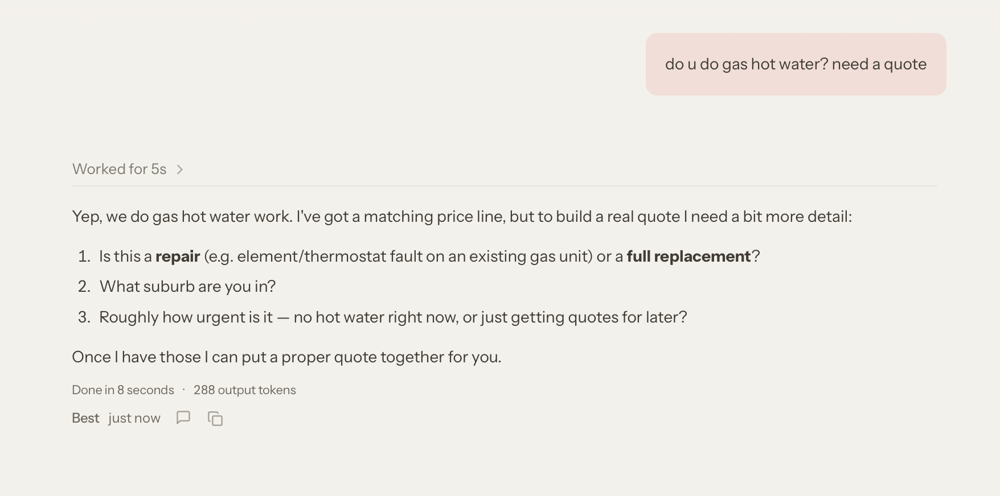
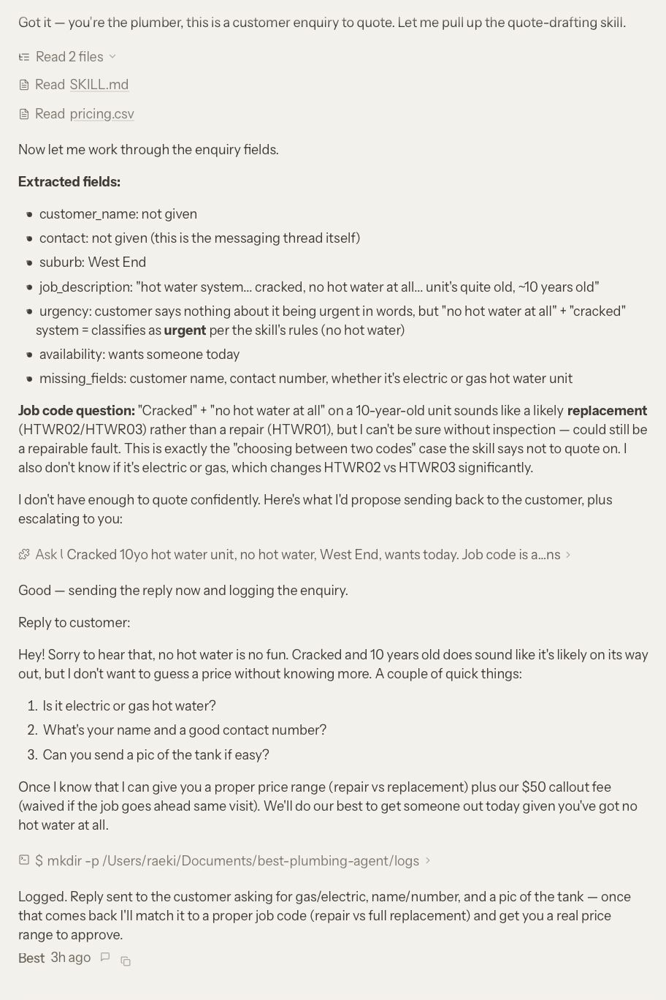
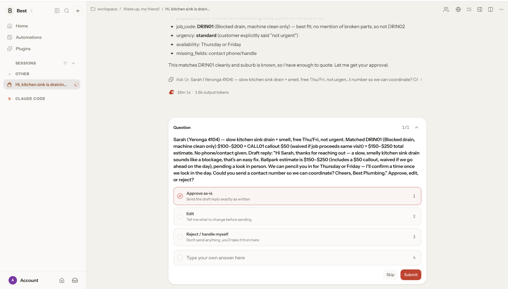
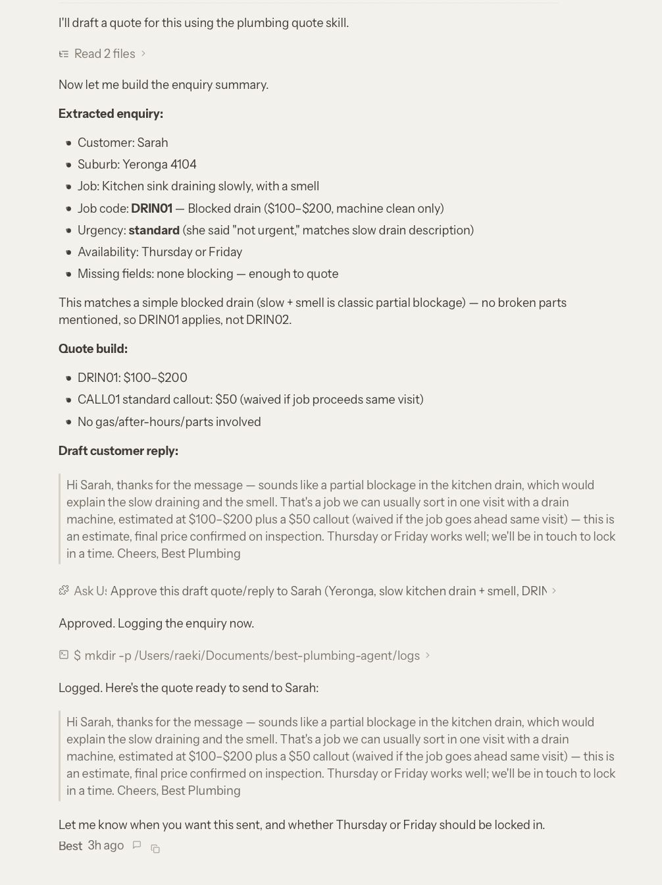
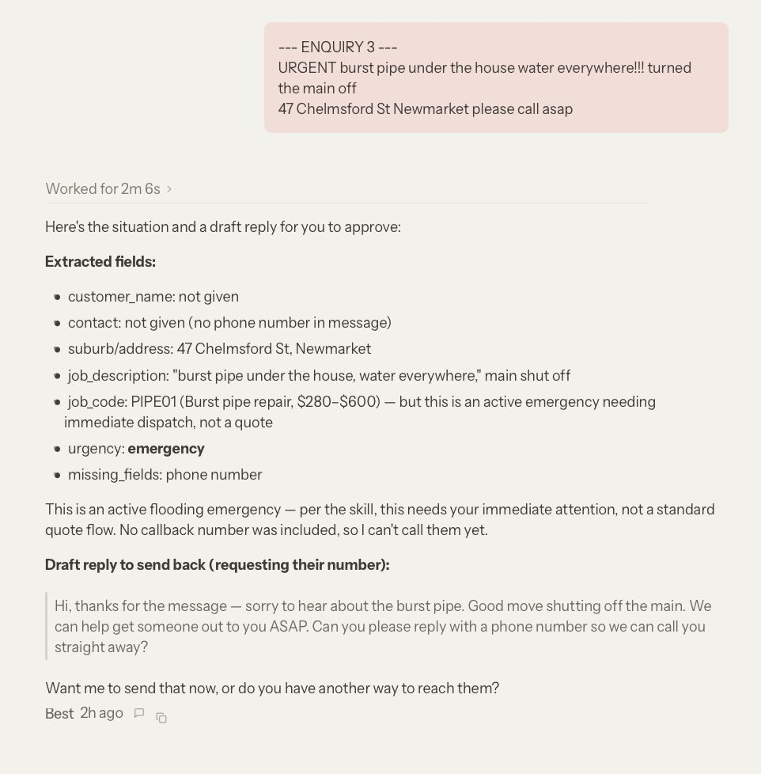
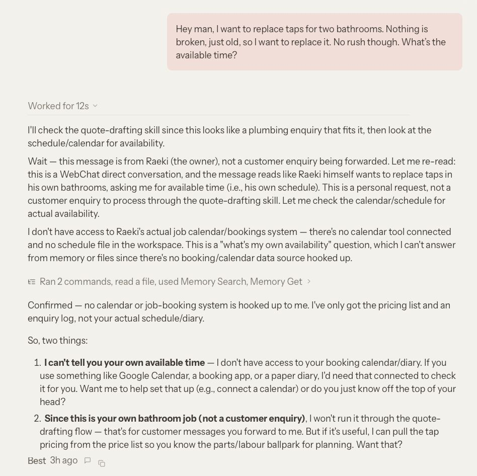

# Best Plumbing — AI Enquiry & Quote Agent

This is an openclaw agent that turns messy and unfiltered customer plumbing enquiries into draft quotes.
The agent gets the price from a fixed price list with the business owner's approval on every message before it gets sent to the client.

---

## The problem

Small businesses lose jobs due to slow enquiry responses. The owner are most likely working on site and reads messages during break or after hours, so quotes get sent late, in which at that point the customer has already called someone else.

With the rapid growth of tech, the obvious fix is to have an AI agent answer questions right away. But there are risks of the agents producing quotes with numbers that are made up. This could lead job loss and or low customer experience.

This project is trying to fix the second problem.

---

## The core rule: prices are looked up, never generated

Every amount the agent outputs must come from a row in `data/pricing.csv`.
The agent must not estimate or average. And if an enquiry doesn't clearly match a certain row, it has to escalate instead of guessing.

The core rule is what drives most of the design, and I got to test it in two ways, once by accident and once on purpose

### Tested on purpose: a vague enquiry

On test enquiry 5, it is only four words with no name, suburb, job type, and no indication if it is a repair or replacement



The result is no price quoted and the agent asking for further information. The three question directly targets the missing fields needed to create a quote or a price estimate. This means the agent worked as intended as a failure would be for the agent to produce it's own estimate.

### Tested by accident: price file missing

During my testing, I typed the wrong file path and it caused the price list to not appear. The agent could simply produce an imaginary amount, but instead it stopped and escalated.

This is an unplanned failure and it turns out the be a good test.

---

## Handling ambiguity

The price list has three hot water rows which are `HTWR01` repair, `HTWR02` replacement, and `HTWR03` gas replacement. When an enquiry could match more than one, the skill
says not to quote.



The agent worked out that electricity or gas was the deciding factor between the codes and asked about it directly. That distinction exists in the CSV but is not written anywhere in the skill instructions. That is why the agent decided that it would need more information to produce a quote.

---

## The approval gate

No response will reach a customer without the owner's approval. The agent would present extracted fields, matched price rows, drafted reply, and any other concerns. The agent will then wait for a confirmation from the owner.



After owner approves it, the enquiries are then logged.



---

## How it works

1. Reads `data/pricing.csv` on every run
2. Extracts structured fields: name, contact, suburb, job description, job code,
   urgency, availability, and missing fields
3. Classifies urgency: `emergency` / `urgent` / `standard` / `quote-only`
4. Decides whether it has enough to quote or does it need further information
5. Builds the quote from the matched row and adding the standard or after-hours
   callout fee
6. Drafts a customer reply in plain English
7. Calls `ask_user` for owner approval
8. Adds a row to `logs/enquiries.csv`

---

## Running the agent

```bash
npm install -g openclaw@latest --allow-scripts=openclaw
openclaw onboard --install-daemon

ln -s "$(pwd)/skills/quote-drafting" ~/.openclaw/workspace/skills/quote-drafting
openclaw skills list

openclaw dashboard
```

Then I test it using the sample enquiries in  `data/sample_enquiries.txt`.

---

## What I found during testing

Full analysis [NOTES.md](NOTES.md). The three that I found most interesting:

### Emergencies exposed a gap in my spec

Burst pipe enquiry matched `PIPE01` at $280-600 correctly, but the agent stopped the quote since it decided that the active flooding need immediate attention rather than a quote price.



Technically it is a better decision than what I had specified, but it isn't what I wanted. The skill files treated urgency and quote or escalate as seperate concept, but the model merged them. 

The failure meant the emergency never got logged.

### Role confusion, and a fix that created a new bug

The agent got confused and didn`t know if I were the customer or the owner. It even offered to search for a plumber instead of drafting a quote. I added a line that say pasted enquiries are forwarded customer messages. 

It then misfired the other way on an enquiry written in first person with no name
or suburb:



The agent thinks that I am the one asking about my own bathroom. This means there are instructions that contradict each other.

### Approval prompts expire

A prompt which ask for an action timed out after 15 minutes, ending the run without approval or logging. For this case where an owner might not check for a couple of hours, this is a design flaw. 

---

## Known limitations

- The agent still guesses if a message are from a customer or from the owner by reading the message. A real life setup would know based on where the message arrived from
- Emergency enquiries bypasses the pricing and logging steps
- Approval prompts expire rather than renotify
- Prices are based of a static csv, not live
- Only 2 of 5 test enquiries were logged

---

## Security notes

The agent has host execution access, so scope was narrowed on purpose:

- **No web search tool.** I did not give the agent web search since it could find a price online instead of my pricelist.
- **macOS file permissions granted to Documents only.** The node requested access to iCloud, Apple Music and Photos during setup, which is not needed.

---

## What I would do and build next

- **Replace the CSV with a live integration** using ServiceM8 or Xero, so prices and
  job history come from the system the business already uses
- **Move sender identity to channel metadata** so the agent never has to guess who
  it's talking to
- **Make logging unconditional** — write the enquiry on receipt, update it on
  approval, so no path can skip it
- **Persist approval requests** rather than expiring them, with renotification

---

## Repo layout

```
skills/quote-drafting/SKILL.md   the agent's instructions
data/pricing.csv                 the price list — the only source of prices
data/sample_enquiries.txt        five test cases
logs/enquiries.csv               output log
demo/                            screenshots from testing
NOTES.md                         full build log, including everything that failed
```

---

## Notes

I built this project simply for me to understand initial concepts since I have no prior experience with OpenClaw. I made this project during the weekend, AI assistance was used when I got stuck on some parts. Altough the design, data, and diagnosis of each test was done by myself.
